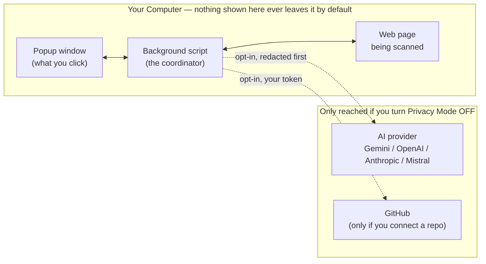
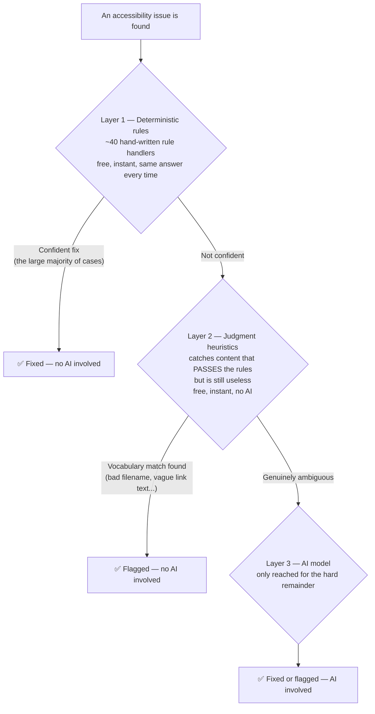
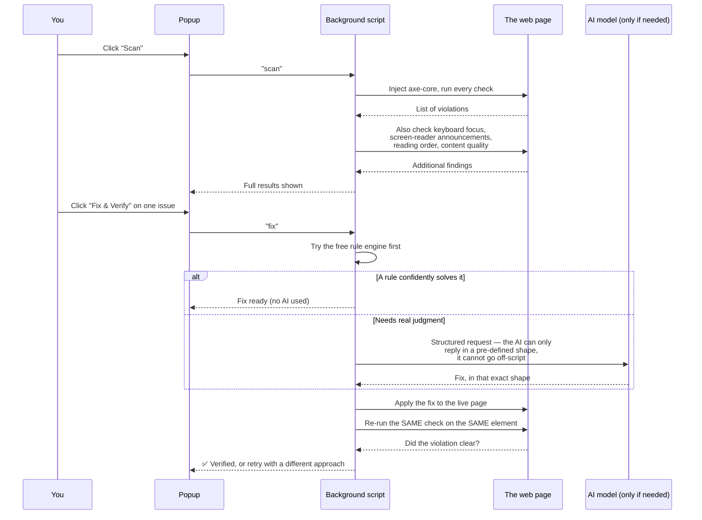
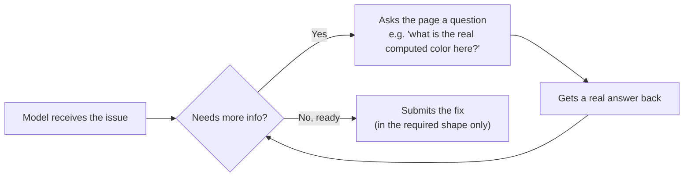
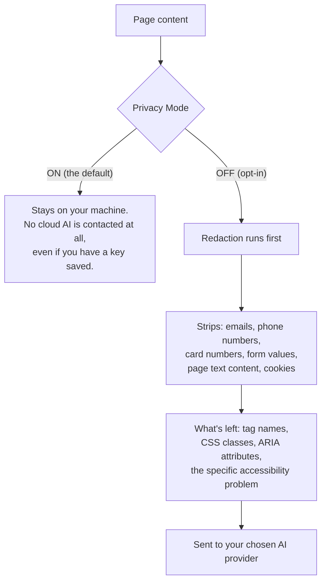

# SiteScope 360 — How It Actually Works

Written for a reader who wants to understand the system, not read the code.
No prior knowledge of Chrome extensions or AI engineering assumed. Diagrams
use [Mermaid](https://mermaid.js.org) — they render natively on GitHub and in
most Markdown viewers (VS Code needs the "Markdown Preview Mermaid Support"
extension, free, one click).

---

## 1. The one idea that explains everything else

There is **no server**. No backend, no database, no company-run cloud. The
entire product is a Chrome extension — a popup window plus a background
script — that runs inside your own browser, on your own machine.

That single decision is why the privacy story is real rather than marketing:
there is no server for your data to sit on, because there is no server.



---

## 2. The tech stack, plainly

| Layer | What it is | Why |
|---|---|---|
| **Extension shell** | Chrome Manifest V3 | The standard, current format for Chrome extensions |
| **Popup UI** | Plain HTML/CSS/JavaScript — no React, no framework | Popups are small; a framework would add weight for no real benefit here |
| **Background logic** | A "service worker" — a script that runs even when the popup is closed | Coordinates everything: scanning, talking to AI, saving results |
| **Scanning engine** | [axe-core](https://github.com/dequelabs/axe-core) — the same open-source engine Lighthouse uses | Industry-standard, free, well-trusted rule checker |
| **AI providers** | Gemini, OpenAI, Anthropic, Mistral — your choice, your own API key | No AI is bundled or paid for by the product; you bring your own account |
| **On-device AI** | Chrome's built-in model (`window.ai`), when available | Runs fixes with zero network call at all |
| **Storage** | `chrome.storage.local` — a small local database built into Chrome | Scan history, settings, and the audit log all live here, on your machine |
| **Code hosting integration** | GitHub's REST API, only if you connect a repo | Lets a fix become a real pull request instead of just a copied snippet |

No npm framework, no build step, no bundler. You could open every file in a
text editor and read it directly — nothing is compiled or hidden.

---

## 3. The three-layer brain

This is the actual core idea of the product, and the reason it doesn't cost
a fortune to run: **most fixes never touch an AI model at all.**

Every issue found is offered to three layers in order. Each layer only
handles what it's actually good at, and passes the rest down.



**Why this matters in plain terms:** if AI answered every single question,
the product would be slow and expensive to run. Instead, a fast free rule
engine handles the obvious cases, a slightly smarter free heuristic layer
handles the "technically-fine-but-actually-useless" cases, and the AI model
— the one part with real cost and real latency — is saved for the cases that
truly need judgment.

---

## 4. What a scan actually does, step by step



The important detail: **verification is a second, independent check**, not
the tool just trusting its own fix. It literally re-runs the scanner against
the patched page and looks for the same violation again.

---

## 5. Where AI is involved — and where it deliberately isn't

| Task | AI involved? |
|---|---|
| Running the initial scan | ❌ No — axe-core, a rule engine |
| Checking keyboard focus, tab order | ❌ No — measured directly by focusing each element |
| Checking screen reader announcements | ❌ No — computed from the page's own markup |
| Flagging bad alt text / vague links | ❌ No — a checklist of known-bad patterns |
| Writing a fix for a straightforward issue | ❌ No — a rule handler generates it |
| Writing a fix for an ambiguous issue | ✅ Yes |
| Looking at a screenshot for visual-only problems | ✅ Yes (needs a multimodal model) |
| Understanding a typed instruction like "fix everything critical" | ✅ Yes |
| Describing what an image actually shows | ✅ Yes |
| Deciding whether a fix is safe to auto-apply | ❌ No — a fixed confidence-score rule, not AI judgment |
| Producing the compliance report / VPAT draft | ❌ No — assembled from data already collected |

**The pattern:** AI writes and interprets. It never decides scores, never
decides what counts as a violation, and never marks something as passing
compliance. Those stay as fixed, auditable logic — because a compliance
number that came from "the AI felt like it passed" is not something anyone
could defend later.

---

## 6. How the AI is actually called (the part people usually get wrong)

Two things make this different from just "prompting a chatbot":

**1. The AI is forced into a shape, not asked nicely.**
Instead of asking the model to write text and hoping it comes back as valid
data, every request defines an exact schema — a fixed shape the answer must
take. The model literally cannot reply outside that shape. This is what
makes a request like *"fix everything critical, don't touch colors"*
reliable: the model can only choose from real options, it can't invent a new
one.

**2. The AI can look before it answers.**
For a hard case — like a contrast fix — the model isn't just given a
snippet of text. It can ask the page real questions first: *what color is
this, really, once the browser has computed it? What does this element's
parent look like?* Only after gathering real facts does it write the fix.



---

## 7. Privacy: what actually leaves the machine



A key detail: if redaction ever fails to run for some reason, the system is
built to **fail closed** — it withholds the content rather than sending it
raw. The safe outcome is the default outcome, not something that depends on
everything going right.

---

## 8. Where things live in the codebase (a map, not a manual)

```
chrome-extension/
├── manifest.json           the extension's ID card — permissions, entry points
├── popup/                  what you see and click
│   ├── popup.html
│   ├── popup.css
│   └── popup.js            all the click-handling logic
├── background/
│   └── service-worker.js   the coordinator — routes every action to the right place
├── content/
│   ├── scanner.js          runs inside the page: highlighting, applying patches
│   └── redactor.js         strips sensitive data before anything goes to the cloud
└── lib/                    the actual "brains" — one file per capability
    ├── llm-router.js       talks to the 4 AI providers behind one interface
    ├── judgment.js         the free heuristic layer (bad alt text, vague links...)
    ├── keyboard.js         focus and tab-order checking
    ├── screenreader.js     announcement simulation
    ├── vision.js           screenshot-based AI checks
    ├── crawl.js             multi-page site scanning
    ├── evidence.js          the compliance report generator
    ├── vpat.js              the conformance-report drafter
    └── github.js             pull request creation
```

Roughly: **`popup/`** is the face, **`background/`** is the coordinator,
**`content/`** is the part that reaches into the actual web page, and
**`lib/`** is where every distinct capability lives as its own small,
self-contained file.

---

## 9. The one-paragraph version, for anyone who only reads this far

SiteScope 360 is a Chrome extension with no backend server — everything runs
in your browser. It scans a page with the same free, open-source engine
Lighthouse uses, then goes further with its own checks for things no
automated rule can catch. Most fixes are generated by fast, free,
rule-based logic; AI is only called in for the genuinely ambiguous cases,
and even then it's constrained to a fixed response shape rather than free
text. Fixing one issue at a time re-scans the live page and won't report
success until the violation is confirmed gone; fixing many issues at once
applies them all, then re-scans as a single follow-up pass. Nothing leaves
your machine unless you explicitly opt in, and
what's sent is stripped of anything sensitive first. The result is exported
as something a developer can actually use — a diff, a pull request — and
recorded as something compliance can actually file — a dated, honestly
scoped evidence report.
